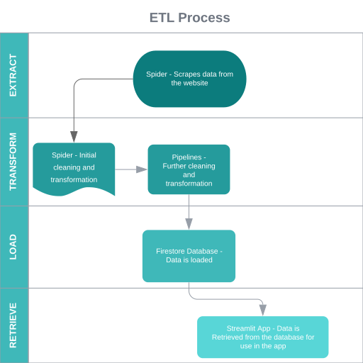

## World Inflation 🌎

❗ Status:

### Introduction
This is a project that has the objective to scrape inflation data from different countries and show the data in a streamlit [app](https://worldinflation.streamlit.app/).
In the app you can see the average and annual CPI inflation for each country and through out the years.

### Tools used 🧰

  Scrapy for Crawling/Scraping
  &nbsp;
   
   
  Supabase as Database
  &nbsp;
   
   
  Streamlit for the app
  &nbsp;

### Extract, Transform, Load
The data was scraped from the [inflation.eu](https://www.inflation.eu/en/) website using [Scrapy](https://scrapy.org/) which also loads the collected data in a [Supabase Database](https://supabase.com/). 
The [streamlit](https://streamlit.io/) app queries the data and displays it.

A diagram of the ETL process can be seen below:

#### Supabase Database
It is a scalable PostgreSQL cloud database, you can use authentication, instant APIs, edge functions, realtime subscriptions, storage, and vector embeddings.
In this case, the database structure is quite simple, if you wish to implement this code, you can change the pipelines to a SQL database like MongoDB or PostgreSQL and run the database locally.

The pipelines set the country name and year as the unique IDs for each document, 
for example Belgium_1999 is one unique ID and Belgium_2000 is another. Each document has four fields: 'annual_inflation', 'average_inflation', 'country', and 'year'.
